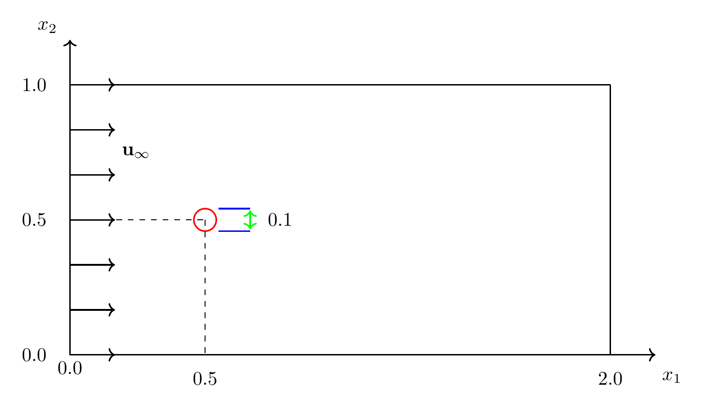
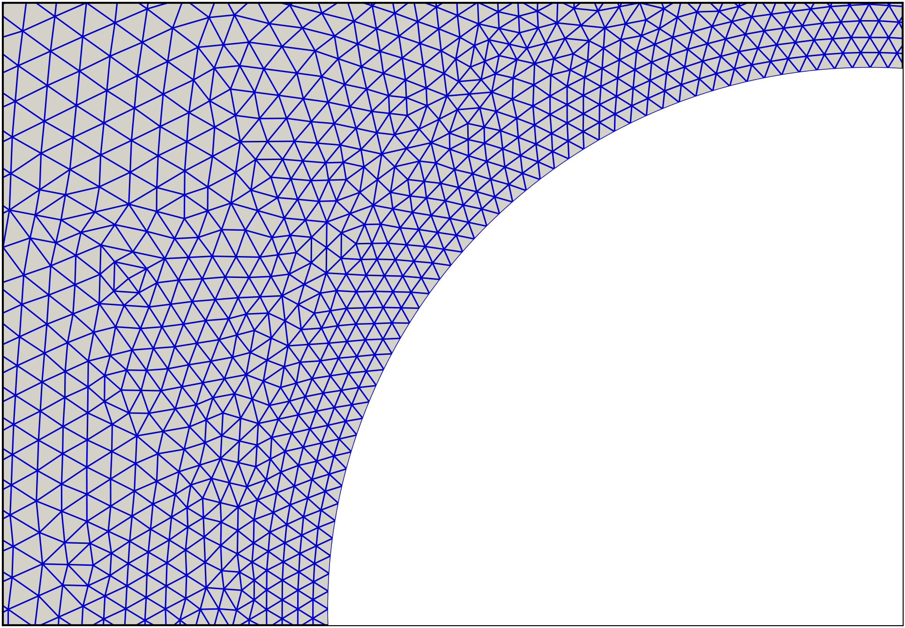

# PASSC: PINN-Augmented SUPG with Shock-Capturing for Inviscid High-Speed Flows

Companion repository for the manuscript

> S. Cengizci, Ö. Uğur,
> **"A physics-informed SUPG-stabilized finite element framework with shock-capturing for simulating inviscid high-speed flows around a cylinder,"**
> submitted to *Journal of Computational Physics*.

> **⚠️ Release status:** The repository is being populated. The mesh and supporting material are provided first; the SUPG-YZβ finite element solver and the PASSC training scripts for each free-stream Mach number (M∞ = 2.0, 5.0, 8.0, 12.0) will be uploaded shortly. Please *Watch* the repository for updates.

## What this code does

The **PASSC** (<ins>P</ins>INN-<ins>A</ins>ugmented <ins>S</ins>UPG with <ins>S</ins>hock-<ins>C</ins>apturing) framework simulates two-dimensional, non-reacting, inviscid high-speed flows of nitrogen gas (N₂, calorically perfect, γ = 1.4) around a circular cylinder, governed by the compressible Euler equations, in **two sequential stages**:

**Stage 1 — Stabilized finite element solver (FEniCS, CPU).**
The transient compressible Euler equations are discretized with the compressible-flow **SUPG** formulation combined with the residual-based **YZβ shock-capturing** technique, providing numerically stable, substantially oscillation-free solutions in the presence of strong bow shocks:

- primitive unknowns **Q** = (ρ, u₁, u₂, T), continuous piecewise-linear (P1) elements on triangles;
- Galerkin part in conservative (divergence) form with consistent Euler boundary fluxes;
- penalty-free, weakly enforced slip condition (u·n = 0) on the cylinder surface;
- semi-implicit backward Euler time marching, damped Newton–Raphson iterations (MUMPS direct solver), CFL-based adaptive time stepping;
- primitive vertex fields stored as snapshots at every accepted time step.

**Stage 2 — Physics-informed correction network (PyTorch, GPU).**
A physics-informed neural network (PINN) is trained **as a post-processor** on the stored FEM snapshots. Rather than learning the flow from scratch, the network is *anchored* to the stabilized solution and targets the artificial numerical diffusion introduced by the stabilization (smeared shocks, mesh-scale serrations, localized oscillations):

- **shock-weighted data-consistency loss** anchoring the network to the last K FEM snapshots;
- governing equations enforced in a **derivative-free space–time control-volume form**, consistent with the Rankine–Hugoniot jump conditions (no autodiff of network outputs in the physics loss);
- **macroscopic conservation windows** and tiling patches supplying shock-spanning, large-scale conservation information;
- **entropy-admissibility penalty** excluding entropy-violating weak solutions;
- boundary-condition losses mirroring the FEM boundary specification exactly;
- random Fourier features, residual blocks (SiLU + LayerNorm), AdamW, and a continuously interpolated loss-weight curriculum.

The output is a continuous, mesh-independent corrected field that remains closely tied to the underlying stabilized finite element approximation.

## Test problem

Inviscid high-speed flow of N₂ past a circular cylinder (radius R = 0.05 m) in a 2 m × 1 m rectangular domain, computed at four free-stream Mach numbers spanning the supersonic and hypersonic regimes:

**M∞ = 2.0, 5.0, 8.0, 12.0**,  with ρ∞ = 1.165 kg/m³, T∞ = 300 K.

<p align="center">
  
  <br/>
  <em>Computational domain (all dimensions in meters). The TikZ source is available in <code>figures/domain.tex</code>.</em>
</p>

All cases share the same unstructured mesh and the same network architecture, epoch budget, and loss-weight schedule — no case-specific tuning.

## Mesh

All computations use a single unstructured triangular mesh (see `mesh/`):

| Property | Value |
|---|---|
| Nodes | 23,934 |
| Triangular elements | 47,264 |
| Domain | [0, 2] m × [0, 1] m |
| Cylinder | R = 0.05 m, centered at (0.5, 0.5) m |
| Near-wall resolution | layers of constant-thickness elements around the cylinder |

<p align="center">
  
  
  <br/>
  <em>Left: full view of the unstructured mesh. Right: layers of constant-thickness elements near the cylinder.</em>
</p>

Boundary treatment: strong Dirichlet (free-stream) at the supersonic/hypersonic inflow; do-nothing (consistent Euler normal flux) at the outflow and the top/bottom boundaries; penalty-free weak slip on the cylinder surface.

## Requirements

**Stage 1 — FEM solver**
- [FEniCS](https://fenicsproject.org/) (legacy DOLFIN interface)
- PETSc with MUMPS (as shipped with FEniCS)
- NumPy

**Stage 2 — PASSC training**
- Python ≥ 3.10
- [PyTorch](https://pytorch.org/) with CUDA support (GPU strongly recommended)
- NumPy, SciPy, Matplotlib

The two stages can be run in separate environments: Stage 1 writes plain snapshot files that Stage 2 reads.

## How to run

Each Mach-number case is driven by a single configuration file in `configs/` and executed in two steps:

```bash
# 1) Stabilized FEM stage (CPU)
#    Solves the Euler equations with SUPG-YZβ and writes the
#    primitive vertex snapshots at every accepted time step.
python fem_solver/run_fem.py --config configs/M5.0.yaml

# 2) PASSC correction stage (GPU)
#    Trains the physics-informed network anchored to the stored
#    snapshots and writes the corrected field + training diagnostics.
python passc/train_passc.py --config configs/M5.0.yaml
```

Replace `M5.0.yaml` with `M2.0.yaml`, `M8.0.yaml`, or `M12.0.yaml` for the other cases. The figures and tables of the manuscript are then regenerated with the scripts in `postprocessing/`.

*(Script names above are indicative; they will be finalized with the code upload.)*

## Repository layout

```
equilibrium_hypersonic/
├── mesh/               # Unstructured triangular mesh (shared by all cases)
├── fem_solver/         # SUPG-YZβ stabilized FEM solver (FEniCS)      [to be uploaded]
├── passc/              # PASSC correction network and training code   [to be uploaded]
├── configs/            # Per-Mach configuration files (M2.0 … M12.0)  [to be uploaded]
├── postprocessing/     # Scripts generating the figures of the paper  [to be uploaded]
└── figures/            # Selected output figures
```

## How to cite

If you use this code or the PASSC methodology, please cite the manuscript (see `CITATION.cff`; a DOI will be added upon publication).

## Funding

The PINN component of this work was developed under Grant No. 225M468 from the Scientific and Technological Research Council of Turkey (TÜBİTAK).

## License

Released under the MIT License — see [`LICENSE`](LICENSE).

## Contact

- Süleyman Cengizci — suleyman.cengizci@antalya.edu.tr (corresponding author)
- Ömür Uğur — ougur@metu.edu.tr
